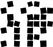

# QRCode Style Class Generate Free QRCode - Written by: https://laptrinhvb.net

> 👉 A library using C# to generate QRCode from https://www.qrcode-monkey.com free  
> ✋ **NOTE:** Do not generate too many QRCode at once or your IP will be locked for a period of time

     
    
    
    
    
    

## Configuration

📘 You can configure to generate QRCode or use default configuration. Below is a list of configurations that you can use

<table>
    <thead>
        <tr>
            <th>Parameter</th>
            <th>Type</th>
            <th>Default</th>
            <th>Description</th>
        </tr>
    </thead>
    <tbody>
        <tr>
            <td>body</td>
            <td>String</td>
            <td>square</td>
            <td>
                
                &nbsp;&nbsp;&nbsp;&nbsp;square
                 
                
                &nbsp;&nbsp;&nbsp;&nbsp;mosaic
                 
                
                &nbsp;&nbsp;&nbsp;&nbsp;dot
                 
                
                &nbsp;&nbsp;&nbsp;&nbsp;circle
                 
                
                &nbsp;&nbsp;&nbsp;&nbsp;circle-zebra
                 
                
                &nbsp;&nbsp;&nbsp;&nbsp;circle-zebra-vertical
                 
                
                &nbsp;&nbsp;&nbsp;&nbsp;circular
                 
                
                &nbsp;&nbsp;edge-cut
                 
                
                &nbsp;&nbsp;edge-cut-smooth
                 
                
                &nbsp;&nbsp;japnese
                 
                
                &nbsp;&nbsp;leaf
                 
                
                &nbsp;&nbsp;pointed
                 
                
                &nbsp;&nbsp;pointed-edge-cut
                 
                
                &nbsp;&nbsp;pointed-in
                 
                
                &nbsp;&nbsp;pointed-in-smooth
                 
                
                &nbsp;&nbsp;pointed-smooth
                 
                
                &nbsp;&nbsp;round
                 
                
                &nbsp;&nbsp;rounded-in
                 
                
                &nbsp;&nbsp;rounded-in-smooth
                 
                
                &nbsp;&nbsp;rounded-pointed
                 
                
                &nbsp;&nbsp;star
                 
                
                &nbsp;&nbsp;diamond
                 
            </td>
        </tr>
        <tr>
            <td>eye</td>
            <td>String</td>
            <td>frame0</td>
            <td>
                <!-- ngRepeat: eye in PresetService.designOptions.eyeFrames -->
                
                &nbsp;&nbsp;frame0
                 
                
                &nbsp;&nbsp;frame1
                 
                
                &nbsp;&nbsp;frame2
                 
                
                &nbsp;&nbsp;frame3
                 
                
                &nbsp;&nbsp;frame4
                 
                
                &nbsp;&nbsp;frame5
                 
                
                &nbsp;&nbsp;frame6
                 
                
                &nbsp;&nbsp;frame7
                 
                
                &nbsp;&nbsp;frame8
                 
                
                &nbsp;&nbsp;frame10
                 
                
                &nbsp;&nbsp;frame11
                 
                
                &nbsp;&nbsp;frame12
                 
                
                &nbsp;&nbsp;frame13
                 
                
                &nbsp;&nbsp;frame14
                 
                
                &nbsp;&nbsp;frame16
                 
            </td>
        </tr>
        <tr>
            <td>eyeBall</td>
            <td>String</td>
            <td>ball0</td>
            <td>
                <!-- ngRepeat: ball in PresetService.designOptions.eyeBalls -->
                
                &nbsp;&nbsp;ball0
                 
                
                &nbsp;&nbsp;ball1
                 
                
                &nbsp;&nbsp;ball2
                 
                
                &nbsp;&nbsp;ball3
                 
                
                &nbsp;&nbsp;ball5
                 
                
                &nbsp;&nbsp;ball6
                 
                
                &nbsp;&nbsp;ball7
                 
                
                &nbsp;&nbsp;ball8
                 
                
                &nbsp;&nbsp;ball10
                 
                
                &nbsp;&nbsp;ball11
                 
                
                &nbsp;&nbsp;ball12
                 
                
                &nbsp;&nbsp;ball13
                 
                
                &nbsp;&nbsp;ball14
                 
                
                &nbsp;&nbsp;ball15
                 
                
                &nbsp;&nbsp;ball16
                 
                
                &nbsp;&nbsp;ball17
                 
                
                &nbsp;&nbsp;ball18
                 
                
                ball19
            </td>
        </tr>
        <tr>
            <td>erf1</td>
            <td>Array</td>
            <td>[ ]</td>
            <td>Rotate the <strong>upper left eye</strong> element. Add <strong>"fv"</strong> or <strong>"fh"</strong> to invert element vertically or horizontally. E.g. ["fv","fh"] inverts a element vertically and horziontally.</td>
        </tr>
        <tr>
            <td>erf2</td>
            <td>Array</td>
            <td>[ ]</td>
            <td>Rotate the <strong>upper right eye</strong> element. Add <strong>"fv"</strong> or <strong>"fh"</strong> to invert element vertically or horizontally. E.g. ["fv","fh"] inverts a element vertically and horziontally.</td>
        </tr>
        <tr>
            <td>erf3</td>
            <td>Array</td>
            <td>[ ]</td>
            <td>Rotate the <strong>lower left eye</strong> element. Add <strong>"fv"</strong> or <strong>"fh"</strong> to invert element vertically or horizontally. E.g. ["fv","fh"] inverts a element vertically and horziontally.</td>
        </tr>
        <tr>
            <td>brf1</td>
            <td>Array</td>
            <td>[ ]</td>
            <td>Rotate the <strong>upper left eye ball</strong> element. Add <strong>"fv"</strong> or <strong>"fh"</strong> to invert element vertically or horizontally. E.g. ["fv","fh"] inverts a element vertically and horziontally.</td>
        </tr>
        <tr>
            <td>brf2</td>
            <td>Array</td>
            <td>[ ]</td>
            <td>Rotate the <strong>upper right eye ball</strong> element. Add <strong>"fv"</strong> or <strong>"fh"</strong> to invert element vertically or horizontally. E.g. ["fv","fh"] inverts a element vertically and horziontally.</td>
        </tr>
        <tr>
            <td>brf3</td>
            <td>Array</td>
            <td>[ ]</td>
            <td>Rotate the <strong>lower left eye ball</strong> element. Add <strong>"fv"</strong> or <strong>"fh"</strong> to invert element vertically or horizontally. E.g. ["fv","fh"] inverts a element vertically and horziontally.</td>
        </tr>
        <tr>
            <td>bodyColor</td>
            <td>String</td>
            <td>#000000</td>
            <td>Color of QR code body as HEX value.</td>
        </tr>
        <tr>
            <td>bgColor</td>
            <td>String</td>
            <td>#ffffff</td>
            <td>Color of QR code background as HEX value. Note: the background should always have a lighter color to be scanable with all devices.</td>
        </tr>
        <tr>
            <td>eye1Color</td>
            <td>String</td>
            <td>#000000</td>
            <td>Color of the <strong>upper left eye</strong> as HEX value.</td>
        </tr>
        <tr>
            <td>eye2Color</td>
            <td>String</td>
            <td>#000000</td>
            <td>Color of the <strong>upper right eye</strong> as HEX value.</td>
        </tr>
        <tr>
            <td>eye3Color</td>
            <td>String</td>
            <td>#000000</td>
            <td>Color of the <strong>lower left eye</strong> as HEX value.</td>
        </tr>
        <tr>
            <td>eyeBall1Color</td>
            <td>String</td>
            <td>#000000</td>
            <td>Color of the <strong>upper left eye ball</strong> as HEX value.</td>
        </tr>
        <tr>
            <td>eyeBall2Color</td>
            <td>String</td>
            <td>#000000</td>
            <td>Color of the <strong>upper right eye ball</strong> as HEX value.</td>
        </tr>
        <tr>
            <td>eyeBall3Color</td>
            <td>String</td>
            <td>#000000</td>
            <td>Color of the <strong>lower left eye ball</strong> as HEX value.</td>
        </tr>
        <tr>
            <td>gradientColor1</td>
            <td>String</td>
            <td>null</td>
            <td>Color 1 for gradient color of body as HEX.</td>
        </tr>
        <tr>
            <td>gradientColor2</td>
            <td>String</td>
            <td>null</td>
            <td>Color 2 for gradient color of body as HEX.</td>
        </tr>
        <tr>
            <td>gradientType</td>
            <td>String</td>
            <td>linear</td>
            <td>Gradient type for color of body. Value can be <strong>"linear"</strong> or <strong>"radial"</strong>.</td>
        </tr>
        <tr>
            <td>gradientOnEyes</td>
            <td>Boolean</td>
            <td>false</td>
            <td>Disable individual colors for the eye elements and set the gradient color for the complete QR code.</td>
        </tr>
    </tbody>
</table>
